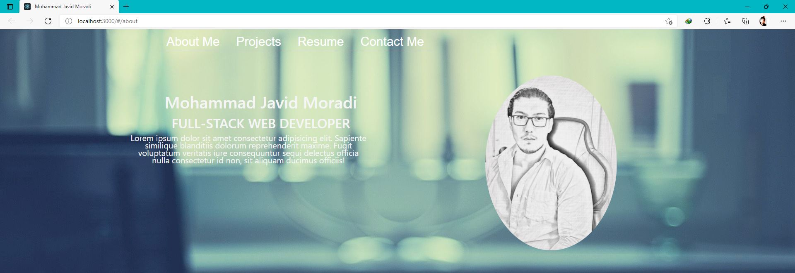

# Personal Portfolio 
##  Description 
This project was an introduction to the React.js in a form of a personal portfolio

## Table of Content 
- [installation](#Installation) 
- [Technologies](#Technologies)
- [Room for development](#Development)
- [Author](#Author)
- [Links](#Links) 

## Installation 
All the dependencies required. to initialize node package, run the following commands. 
```
npm install
```

## Technologies 
1. React.js 
2. Bootstap 
3. node.js

## Screenshot 


## Development
- This portfolio will be added to linked, all projects needed to be add 
- database for projects 
- new technologies 
- content needs to be updated 

## Author 
Mohammad Javid Moradi 

## Links 
[https://moradi1412.github.io/R-Portfolio/](https://moradi1412.github.io/R-Portfolio/)
[https://github.com/moradi1412/R-Portfolio](https://github.com/moradi1412/R-Portfolio)
